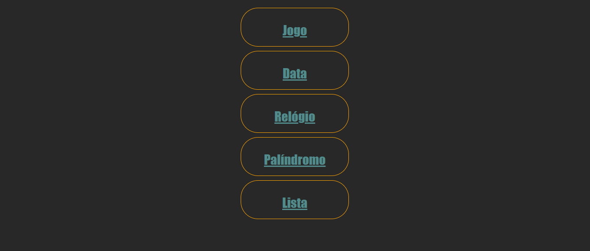
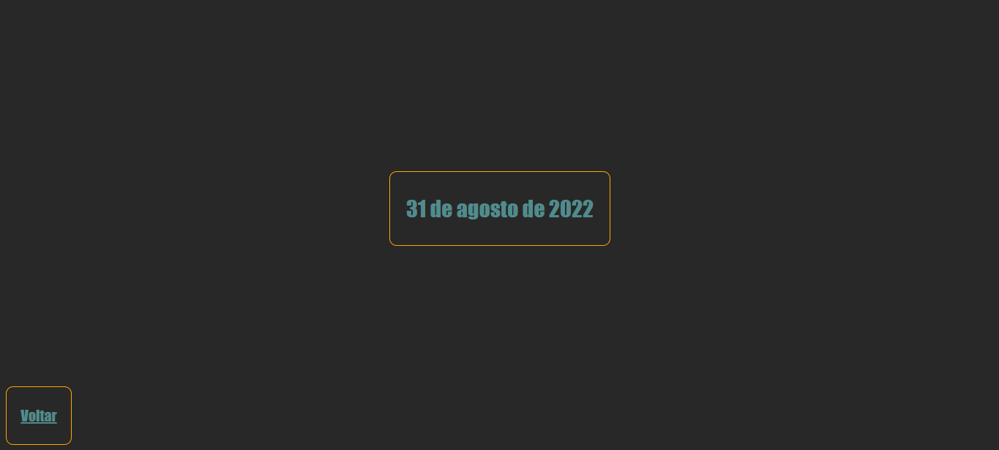
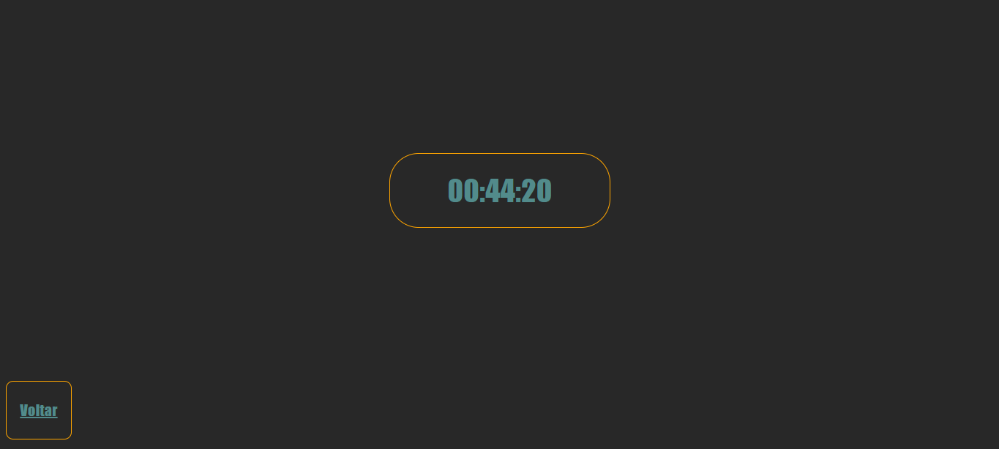
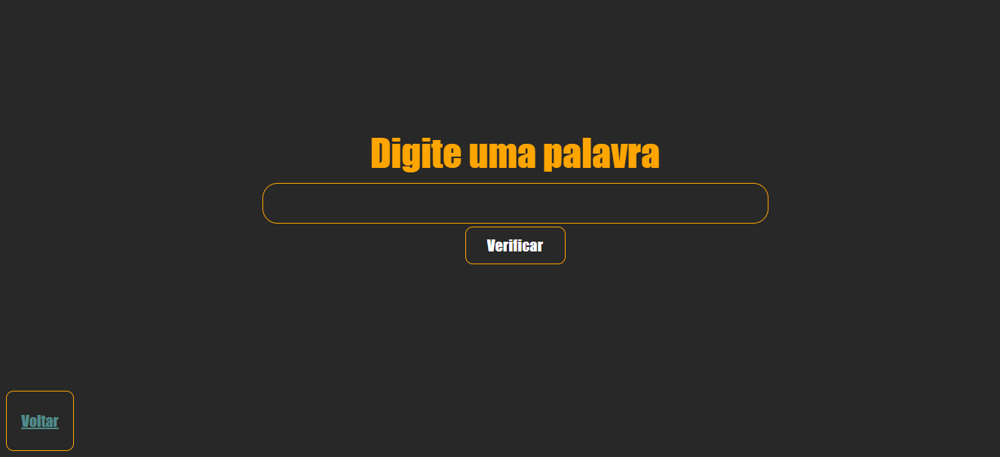

Exercícios feitos com utilização do java script, css e HTML
##
Todos os exercícios poderão ser acessados pelo index e vice-versa
##
index  
 
##
Data  

##
Relógio  
 
##
Palíndromo  

##
Lista  
